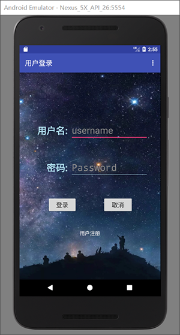
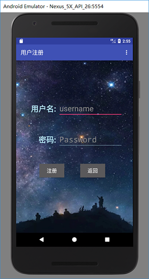
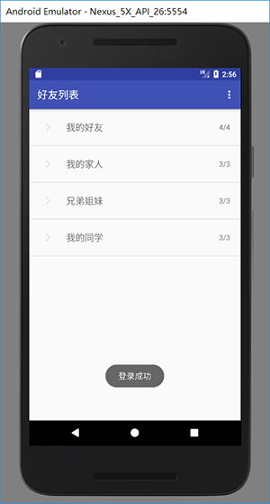
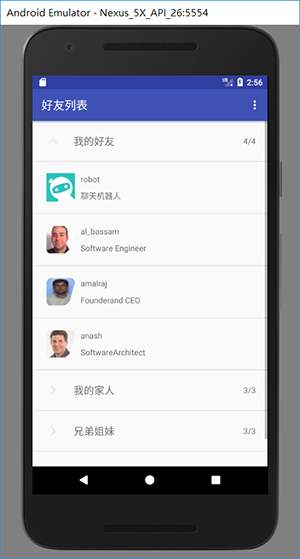

# 安卓聊天软件的Demo

**比较突出的一点就是实现了一个简单聊天机器人的功能**

## 使用的库

- Litepal数据库
- percent百分比布局库
- recycleview库
- okhttp3库

***build.gradle的dependencies***
```
dependencies {
    implementation fileTree(dir: 'libs', include: ['*.jar'])
    implementation 'com.android.support:appcompat-v7:26.1.0'
    implementation 'com.android.support.constraint:constraint-layout:1.0.2'
    testImplementation 'junit:junit:4.12'
    androidTestImplementation 'com.android.support.test:runner:1.0.1'
    androidTestImplementation 'com.android.support.test.espresso:espresso-core:3.0.1'
    compile 'org.litepal.android:core:1.6.0'
    compile 'com.android.support:appcompat-v7:26.1.0'
    compile 'com.android.support:recyclerview-v7:26.1.0'
    compile 'com.android.support:percent:26.1.0'
    compile 'com.squareup.okhttp3:okhttp:3.9.1'
}

```
## 功能
    
- **登录界面与注册界面**

    + 使用数据库来保证用户账号是必须注册的， 为后续可能加入远程服务器留后路
    + 注册账号的要求和一般注册账户差不多，要求密码长度6-16位，用户名不能已存在等
    + （掌握使用了百分比相对布局，可能解决了分辨率问题？**未尝试！！** 后面的有些活动没用到百分比布局， 分辨率肯定是个问题）

- **好友列表功能**
    
    + 列表中的元素只是为了测试所以加的
    + 列表中的元素除聊天机器人外，点击后均显示的是一个Toast信息，后续可自己添加 
    + 基本完成了普遍聊天软件的好友列表，后续可加入好友在线或无上线状态，左侧的组“3/3”可根据实际来变化

- **聊天机器人功能**

    + 使用的是图灵机器人的API接口
    + 从Json数据来获取机器人的回复消息，从而实现聊天机器人的功能 

- **socket通信功能**

    + 项目中的server文件夹中的代码为服务端代码， 好友列表中的socketTest为客户端
    + 实现了客户端服务端之间的通信

## 界面

### 登录界面



### 注册界面



### 好友列表





### 机器人聊天界面

