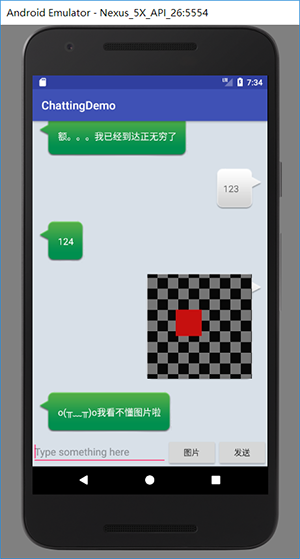

# 安卓聊天软件的Demo

## 使用的库

- Litepal数据库
- percent百分比布局库
- recycleview库
- okhttp3库

***build.gradle的dependencies***
```
dependencies {
    implementation fileTree(dir: 'libs', include: ['*.jar'])
    implementation 'com.android.support:appcompat-v7:26.1.0'
    implementation 'com.android.support.constraint:constraint-layout:1.0.2'
    testImplementation 'junit:junit:4.12'
    androidTestImplementation 'com.android.support.test:runner:1.0.1'
    androidTestImplementation 'com.android.support.test.espresso:espresso-core:3.0.1'
    compile 'org.litepal.android:core:1.6.0'
    compile 'com.android.support:appcompat-v7:26.1.0'
    compile 'com.android.support:recyclerview-v7:26.1.0'
    compile 'com.android.support:percent:26.1.0'
    compile 'com.squareup.okhttp3:okhttp:3.9.1'
}

```
## 功能
    
- **登录界面与注册界面**

    + 默认管理员账号为 admin, 密码 123456
    + 注册账号的要求用户名和密码不为空，密码长度6-16位，且用户名不能已存在(数据库会检查)
    + 登录界面会判断用户名是否存在数据库，且密码是否正确，正确则进入好友列表
    + 记住密码，下次用户登录时用户名和密码无需再次填写
    + 自动登录，下次运行程序时，则自动登录


- **好友列表功能**
    
    + 列表中的元素只是为了测试所以加的
    + 列表中的元素除聊天机器人和socketTest外，点击后均显示的是一个Toast信息，后续可自己添加 
    + 基本完成了普遍聊天软件的好友列表


- **聊天机器人功能**

    + 使用的是图灵机器人的API接口
    + 从Json数据来获取机器人的回复消息，从而实现聊天机器人的功能 
    + 可以发送图片
    + 聊天记录将保存在数据库中，下次进行聊天还能看见以前的聊天记录



- **socket通信功能**

    + 项目中的server文件夹中的代码为服务端代码， 好友列表中的socketTest为客户端
    + 实现了客户端服务端之间的通信


